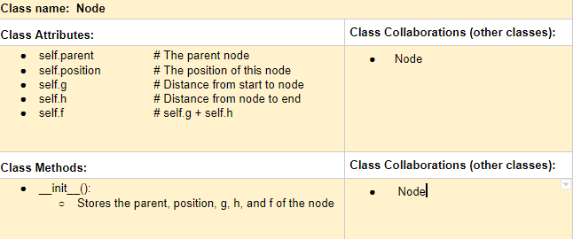
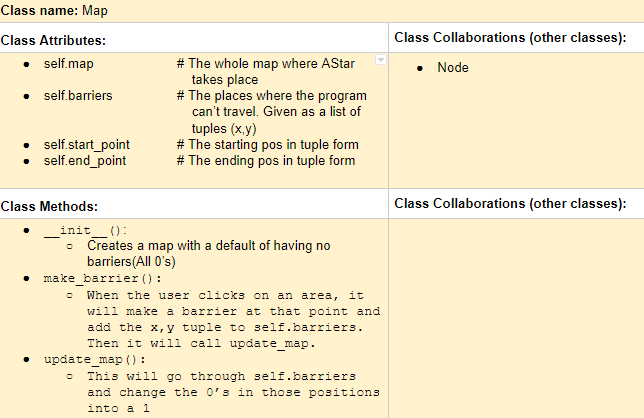

# NOTE: THIS IS MY PROJECT WHICH WAS COPIED FROM MY PRIVATE REPOSITORY

# P01: My 226 Final Project

**Term**: Fall 2019

️**Author**: Abraham Moreno

️**Section**: A

**References**: 
1. https://en.wikipedia.org/wiki/A*_search_algorithm

---

## Milestone 1: Setup, Planning, Design

️**Project Title**: AStar Path Finding

**Purpose**: To find the shortest distance to the end point given a starting point and obstacles.

️**Sources**: T01, A05

️**Completed CRC card for the class you will implement**:
  

## Milestone 3: Virtual Check-in

️**Completion Percentage**:  50%

---

## Milestone 4: Final Code, Presentation, Demo

### User Instructions
Upon clicking run, a screen with a grid and buttons will come up to the right. The usable buttons will not be disabled
upon starting. Click on the "Starting Position" and pick a spot on the grid. Do the same for the "Ending Position".
Since only these two are needed for AStar to run, the "Find Path" button will unlock. You can choose to find the path or
add barriers. When you add barriers, you restrict where the algorithm can go. You can also remove barriers (removing
a barrier that doesn't exist won't do anything). Also, you can reset the start and the end position, but in doing so
the "Find Path" button will be blanked out once again until you choose the starting and/or ending positions again.

### Errors and Constraints
There are no errors or bugs as far as I know. The program could be more efficient, however. I could've packed
all of the functions in the nodeFunctions.py file into a class, but that would've meant I would've had to modify a big
portion of the code. If I were given more time, I would've added the functions in nodeFunctions.py to the Map class
because though they have to do with nodes, they affect all of the nodes.

Things I would've liked to add if I was given more time:
1. Instead of making my own matrix in the Map class, have it so that the Map class could generate its own matrix
   given the number of rows and columns.
2. Let the user input the number of rows and columns. It would have been really simple through the terminal, but that
   would take away from the GUI.
3. Made images for the starting position and the ending position to make the program more appealing.
4. Animations to make the visual path from start to finish more smooth.
5. Color the nodes that are in the closed an open list to make it more visual
6. Use another library other than Tkinter because upon doing some research, there are some others that are better
   and provide more customization, but I found this out half-way through the project.

### Reflection
I chose to do a project on A Star Path Finding because it is an algorithm. I have previously done a lot
of work on websites, scripts, and servers, but algorithms always intrigued me because they are more towards the area
of machine learning and artificial intelligence. I started to do research on algorithms and path finding. I came
across one called Dijkstra's Path Finding Algorithm. I read into it and found that it was less efficient than an
algorithm called A Star Path finding. This is when I chose A Star.

I was surprised at how close I got it to be. The only thing that I didn't manage to do that was in my initial plan was
animating the path, open, and closed nodes. The styling could be a little better, like centering everything on the
screen, but that would've taken more time and possibly required another library other than Tkinter. I learned how
important a test suite is. Due to the fact that this is a larger project, if one function fails, then it's hard to fix
it without knowing which function broke. The test suite allowed me to test each function and find which ones work
and which ones don't.

The hardest part for me was the simplest part: commenting. I'm so used to just going off on coding without writing
comments. Since I write the code, I know what each line does; therefore, I tend to not write comments. That doesn't
mean that I don't see the value in them. I do; especially if I'm in a group. It's more of a habit that I'm working on.
For this project, I wrote a lot of code, then I went in and wrote comments. The one thing I would definitely do
differently next time is writing comments as I go. The comments alone took up a lot of time because of the way I chose
to do them.
